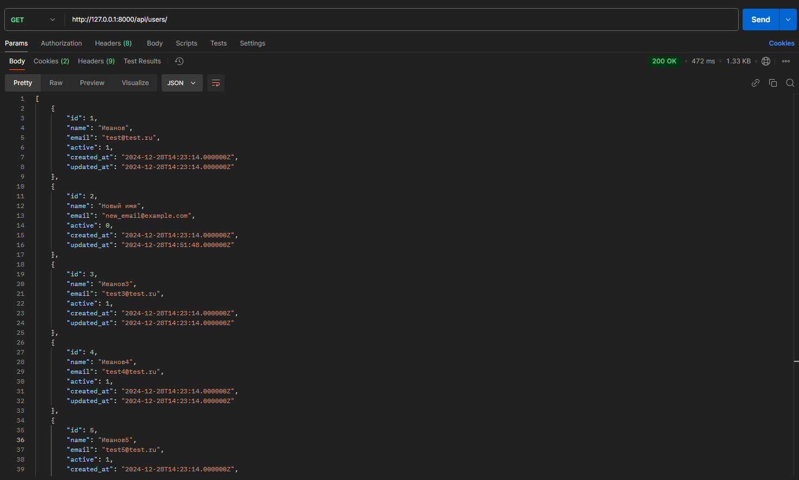

## CRUD Users
### Получение всех пользователей
- GET http://127.0.0.1:8000/api/users/

### Получение пользователя по id
- Get http://127.0.0.1:8000/api/users/{id}


### Создать нового пользователя
- POST http://127.0.0.1:8000/api/users
- Тело запроса:
 ```
{
    "name": "",
    "email": ""
}
 ```

### Обновить пользователя
- PUT http://127.0.0.1:8000/api/users/{id}
- Тело запроса:
 ```
{
    "name": "",
    "email": "",
    "active": true/false(1/0)
}
 ```

### Удалить пользователя
- DELETE http://127.0.0.1:8000/api/users/{id}


## CRUD Groups
### Создать новую группу
- POST http://127.0.0.1:8000/api/groups
- Тело запроса:
 ```
{
    "name": "Группа13",
    "expire_hours": 1
}
 ```

### Обновить группу
- PUT http://127.0.0.1:8000/api/groups/{id}


### Получить группу по ID
- GET http://127.0.0.1:8000/api/groups/{id}


### Получить все группы
- GET http://127.0.0.1:8000/api/groups


## Добавление пользователя в группу
- POST http://127.0.0.1:8000/api/users/{id}/add-to-group
- (Время указывается МСК + кол-во часов группы)
- Тело запроса:
 ```
{
    "group_id": {id}
}
 ```


## Добавление через консоль


## Удаление через консоль
(если не ошибаюсь gmail почты не работают)


## Выполнение каждые 10 минут
Через php artisan schedule:run, можно запустить это выполнение
